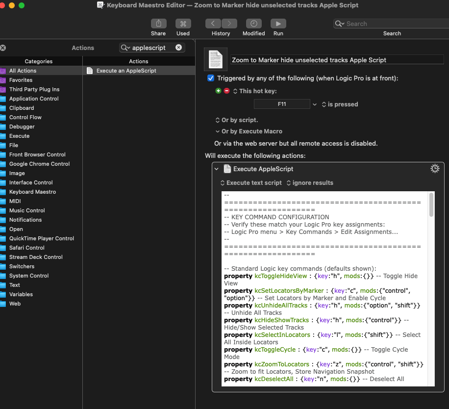

# Logic Pro Scripts: Focus on Marker, Focus on Locators

There are two AppleScripts here to help you focus on a small part of a large project.

1. Focus on Marker
Hides all tracks that do not have content within the bounds of the current marker, then zooms the display to the time range of the current marker.

2. Focus on Locator
Hides all tracks that do not have content within the bounds of the locators, then zooms the display to the time range of the locators.

## Demo


Pressing a key in Keyboard Maestro runs the script which takes a large project with lots of empty space and makes content within the current marker visible and hides tracks that do not have content within the current marker.

## What the scripts do

1. Shows any currently hidden tracks
2. Focus Marker only: Sets the locators to the nearest marker and enables Cycle mode
3. Unhides all tracks
4. Marks all tracks as hidden
5. Selects all regions within the locator range
6. Unhides tracks that have content within the locator range
7. Zooms the Tracks area to fit the locators
8. Disables Cycle mode and deselects everything

The result is a focused view of just the tracks that are active in the selected section.

## Limitations and known issues

The scripts were tested with Logic version 11.1.1.  Because the UI layout of Logic may change between versions, the method used to read the state of the **Hide** button may break in other versions.

Your Logic project window needs to have the Toggle Hide button visible and the Cycle button visible.  If your Logic window is so small that these controls are not shown, then the scripts will fail.

This approach doesn't always work as expected with track stacks.

The Cycle button and the Toggle Hide button must both be visible within the Logic window before running the scripts.

Very large projects can cause the scripts to take a long time to run.  I have a project that takes 20 seconds to run.

## Requirements

- macOS
- Logic Pro (tested with version 11.1.1)
- Accessibility permissions granted to Script Editor, Keyboard Maestro (or whichever app runs the script):
  **System Settings → Privacy & Security → Accessibility**

## Installation

### Run it Manually

1. Open **Script Editor** (found in `/Applications/Utilities/`)
2. Paste the script contents into a new document
3. Save as a **Script** (`.scpt`) or **Application** (`.app`)

### Keyboard Maestro

1. Create a new Macro and set up the trigger so it runs when a key is pressed.
2. Create a new action for the macro.  Search for "applescript".  Double click "Execute an AppleScript".
3. Paste the script contents into the script text box



## Configuration

Near the top of the script is a configuration section. Most key commands use Logic Pro's defaults and should work without changes. One command must be assigned manually:

```applescript
-- Standard Logic key commands (defaults shown):
property kcToggleHideView      : {key:"h", mods:{}}
property kcSetLocatorsByMarker : {key:"c", mods:{"control", "option"}}
property kcUnhideAllTracks     : {key:"h", mods:{"control", "shift"}}
property kcHideShowTracks      : {key:"h", mods:{"control"}}
property kcSelectInLocators    : {key:"l", mods:{"shift"}}
property kcToggleCycle         : {key:"c", mods:{}}
property kcZoomToLocators      : {key:"z", mods:{"control", "shift"}}
property kcDeselectAll         : {key:"d", mods:{"shift"}}

-- Custom key commands (you must assign these in Logic Pro):
property kcSelectAllTracks     : {key:"a", mods:{"control", "shift"}}
```

### Assigning the custom key command

`kcSelectAllTracks` (**Select All Tracks**) has no default key assignment in Logic Pro. To assign one:

1. Open **Logic Pro → Key Commands → Edit Assignments…**
2. Search for **"Select All Tracks"**
3. Assign the key combination shown in the configuration (default: `⌃⇧A`)

If you change any key assignments in Logic Pro, update the corresponding entry in the configuration section to match.

## Development

I had originally created the script as a Keyboard Maestro macro - sending a series of keystrokes to Logic Pro.  It soon became clear that Keyboard Maestro could send keys to Logic faster than Logic could process them.  This meant that when Logic took some time to process, subsequent keys were lost.  So I put in delays after each key.  But for large projects, some commands took a really long time to run.  So I had to put in bigger and bigger delays just in case.

A second problem is that the macro required a Logic project to be in a known state at the start.  Logic doesn't have a way of turning **Hide** off.  It just has a key command for **Toggle Hide View**.  The script needs to have **Hide** off when it starts.

So I spent some time with Claude code converting this into an AppleScript program and worked out ways to overcome these problems.  We experimented until we figured out how to read the state of UI elemnts within Logic, and also found a way to determine whether Logic is "busy".

You can read the transcript of the development process here: 


## How It Works

The script uses macOS's [Accessibility API](https://developer.apple.com/documentation/applicationservices/accessibility_api) (via AppleScript System Events) to:

- Read the state of Logic Pro's UI elements (Hide Tracks toggle, Cycle button) without opening any menus
- Detect when Logic Pro has finished processing each command before sending the next one, by polling the accessibility API — Logic Pro returns an error when queried while busy, which the script uses as a ready signal

This makes the script adaptive: it waits exactly as long as Logic needs for each step, rather than using fixed delays that may be too short for large projects or unnecessarily long for small ones.
